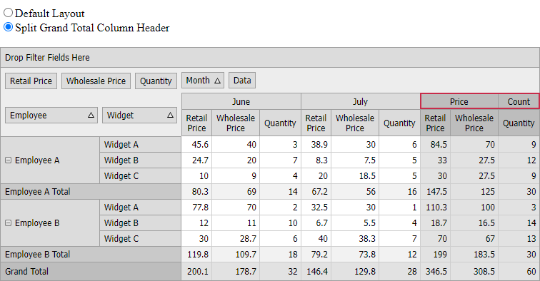

<!-- default badges list -->

<!-- default badges end -->
# Pivot Grid for Web Forms - Split Field Value Cells

The following example demonstrates how to split field value cells. In this example, the Grand Total column header is split into two cells: *Price* and *Count*.

Handle the [CustomFieldValueCells](https://docs.devexpress.com/AspNet/DevExpress.Web.ASPxPivotGrid.ASPxPivotGrid.CustomFieldValueCells) and call the event parameter's [Split](https://docs.devexpress.com/AspNet/DevExpress.Web.ASPxPivotGrid.PivotCustomFieldValueCellsEventArgs.Split.overloads) method is used. Cells that should be split are identified by a predicate that returns `true` for those cells. The quantity, size and captions of newly created cells are specified by an array of cell definitions (the `FieldValueSplitData` objects).

## Files to Review

* [Data.cs](./CS/ASPxPivotGrid_SplittingCells/Data.cs) (VB: [Data.vb](./VB/ASPxPivotGrid_SplittingCells/Data.vb))
* [Default.aspx](./CS/ASPxPivotGrid_SplittingCells/Default.aspx) (VB: [Default.aspx](./VB/ASPxPivotGrid_SplittingCells/Default.aspx))
* [Default.aspx.cs](./CS/ASPxPivotGrid_SplittingCells/Default.aspx.cs) (VB: [Default.aspx.vb](./VB/ASPxPivotGrid_SplittingCells/Default.aspx.vb))

## Documentation

* [Field Value](https://docs.devexpress.com/AspNet/3597/components/pivot-grid/ui-elements/field-value)

## More Examples

- [Pivot Grid for Web Forms - How to Hide Specific Rows and Columns](https://github.com/DevExpress-Examples/how-to-hide-particular-rows-and-columns-e2767)

<!-- feedback -->
## Does this example address your development requirements/objectives?

 

(you will be redirected to DevExpress.com to submit your response)
<!-- feedback end -->
